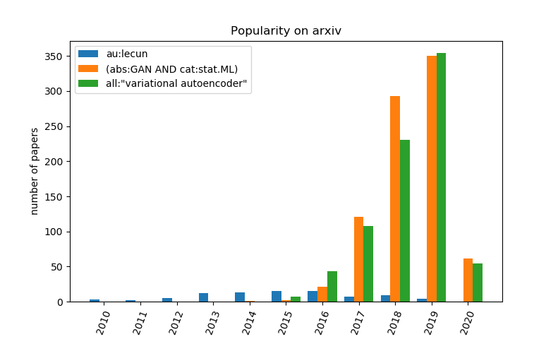

# arxiv stats [](https://www.python.org/downloads/)

Collects the number of hits per year of a desired *query* on [arxiv](https://arxiv.org/) vie the [arxiv API](https://arxiv.org/help/api).

# Usage
Run:

```
arxiv_stats.py
```

and enter your queries (semicolon separated).

#### Query examples:

```
electron
au:Pearl ; ti:"gradient descent" ; all:"linear regression"
abs:dropout AND au:hinton ; cat:cs.AI OR cat:cs.LG
abs:"swarm robotics" ; (all:"variational autoencoder" OR all:VAE) AND cat:stat.ML
```

See the [arxiv API manual](https://arxiv.org/help/api/user-manual#query_details) for a detailed description of possible query structures.
In particular, the list of valid categories is available [here](https://arxiv.org/help/api/user-manual#subject_classifications).

#### Results

Here is a typical example for the query ```abs:"swarm robotics"```:

```
--------------
Querying arxiv API: abs:"swarm robotics"
Total number of entries to collect: 67
67 / 67 (100.0 %) entries collected in 1.46 seconds
Extract dates from entries
RESULTS:
	QUERY: abs:"swarm robotics" 
	STATS: [(2004, 1), (2005, 0), (2006, 0), (2007, 0), (2008, 0), (2009, 0), (2010, 0), (2011, 4), (2012, 1), (2013, 4), (2014, 1), (2015, 4), (2016, 3), (2017, 6), (2018, 18), (2019, 21), (2020, 4)]
```

In case [pyplot](https://matplotlib.org/api/pyplot_api.html) is installed on your machine, a bar graph will also display the results. Here is an example for the query ```au:lecun; (abs:GAN AND cat:stat.ML); all:"variational autoencoder"```:

